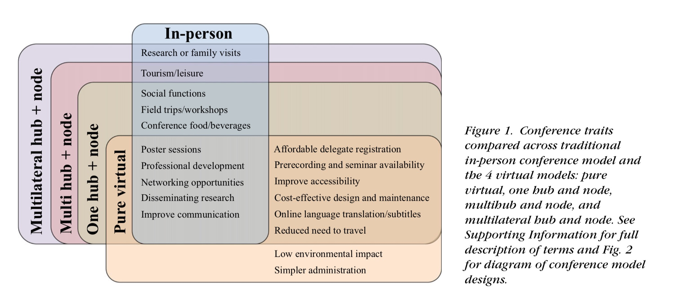
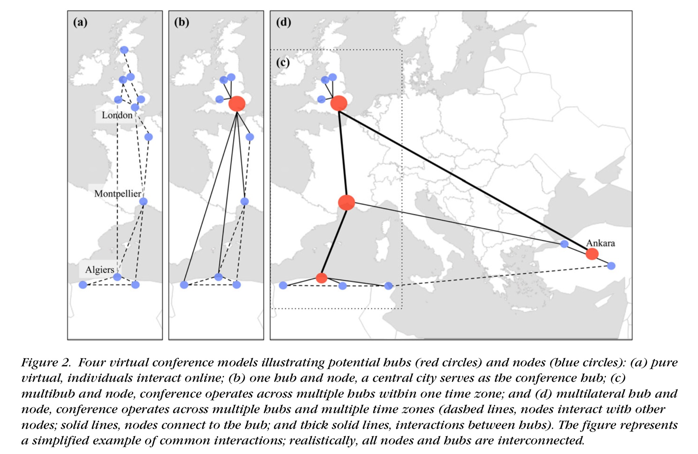

    

# The value of virtual conferencing for ecology and conservation    

### Hannah Fraser1*, Kylie Soanes2, Stuart A. Jones3, Chris S. Jones1,4 & Matthew Malishev3  

##### _1Quantitative and Applied Ecology Group, School of BioSciences, University of Melbourne, Parkville 3010, Melbourne, Victoria, Australia_    

##### _2School of Ecosystem and Forest Science, University of Melbourne, Parkville 3010, Melbourne, Victoria, Australia_  

##### _3Centre of Excellence for Biosecurity Risk Analysis (CEBRA), School of BioSciences, University of Melbourne, Parkville 3010, Melbourne, Victoria, Australia_   

##### _4Biosis Pty Ltd, Port Melbourne 3207, Melbourne, Victoria, Australia_   

##### *Corresponding author: Hannah Fraser  

Fraser H, Soanes K, Jones C, Jones S & **Malishev M** (2017) The value of virtual conferencing for ecology and conservation. _Conservation Biology,_ 31(3): 540–546, [https://doi.org/10.1111/cobi.12837](https://conbio.onlinelibrary.wiley.com/doi/full/10.1111/cobi.12837).       

******

File extensions:   
.py  
.R    
.csv  
.pdf  

******  

## Abstract  

The objectives of conservation science and dissemination of its research create a paradox: Conservation is about preserving the environment, yet scientists spread this message at conferences with heavy carbon footprints. Ecology and conservation science depend on global knowledge exchange–getting the best science to the places it is most needed. However, conference attendance from developed countries typically outweighs that from developing countries that are biodiversity and conservation hotspots. If any branch of science should be trying to maximize participation while minimizing carbon emissions, it is conservation. Virtual conferencing is common in other disciplines, such as education and humanities, but it is surprisingly underused in ecology and conservation. Adopting virtual conferencing entails a number of challenges, including logistics and unified acceptance, which we argue can be overcome through planning and technology. We examined four conference models: a pure-virtual model and three hybrid hub-and-node models, where hubs stream content to local nodes. These models collectively aim to mitigate the logistical and administrative challenges of global knowledge transfer. Embracing virtual conferencing addresses two essential prerequisites of modern conferences: lowering carbon emissions and increasing accessibility for remote, time- and resource-poor researchers, particularly those from developing countries.     

******    

## Output  

  

     

  

******    

## Maintainer    
**Matt Malishev**     
:mag: [Website](https://darwinanddavis.github.io/DataPortfolio/)        
:bird: [@darwinanddavis](https://twitter.com/darwinanddavis)    
:email: matthew.malishev [at] gmail.com        